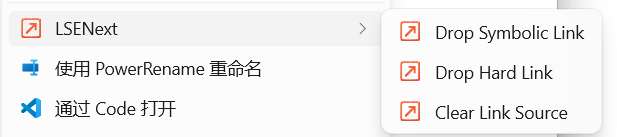

# LSENext (Link Shell Extension Next)

LSENext is a modern **Windows 11 Explorer shell extension** — a **Link Shell Extension successor** — focused on fast right-click **context menu** creation of:

- **Symbolic links** (symlink)
- **Directory junctions** (junction)
- **Hard links** (hardlink)

> Keywords: Link Shell Extension, Link Shell Extension Next, LSE, Windows 11 context menu, Explorer shell extension, symlink, junction, hardlink.

## Demo



## v0.2.1 Scope

- Pick one or more link sources from Explorer.
- Drop file/directory symbolic links into a target directory.
- Drop file hard links for file sources.
- Drop directory junctions for directory sources.
- Register LSENext as a Windows 11 native Explorer context menu through package identity when setup finishes in the signed-in user's session.
- Unregister the per-user package identity when uninstall finishes in the signed-in user's session.
- Preserve picked state per user at `%LOCALAPPDATA%\LSENext\state.json`.
- Build x64 and arm64 Windows artifacts from GitHub Actions.

## Build

```powershell
cargo test --workspace
```

Packaging is done in GitHub Actions:

- `.github/workflows/alpha.yml` for alpha pre-releases
- `.github/workflows/release.yml` for manual pre-releases

Artifacts are published from the workflow run and written to `artifacts\` during the job.
